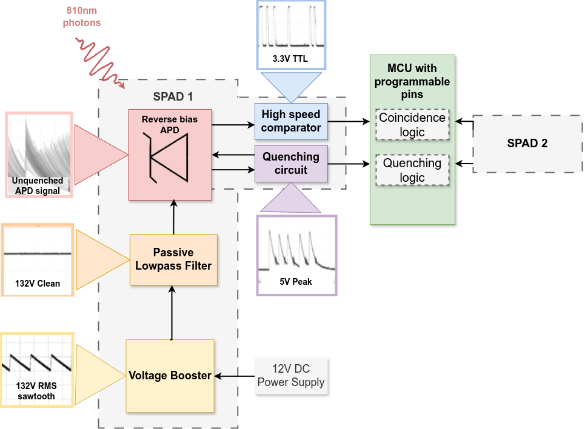
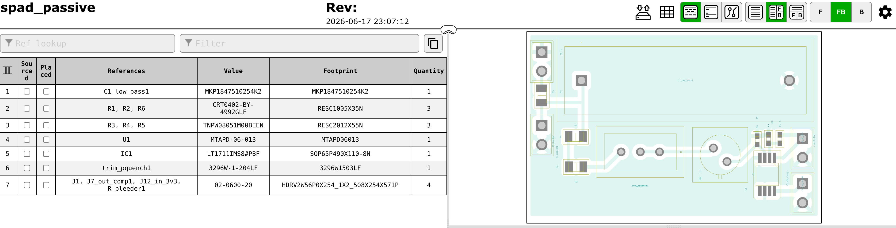

# Custom Single Photon Avalanche Detection system with integrated coincidence logic

## Overview


## BOM

Minimal working




[bom_interactive](./bom/ibom.html)


## BOM in test


### APD
| Name | Link                                                 | Price   | Qty | Description            | Code             | Check |
| ---- | ---------------------------------------------------- | ------- | --- | ---------------------- | ---------------- | ----- |
| APD  | https://ro.mouser.com/ProductDetail/193-MTAPD-06-001 | 37,21 € | 2   | Peak Wavelength: 800nm | 193-MTAPD-06-001 | [x]   |


### Voltage Booster + Filter

|                           |                         |           |                    |       |          |      |     |     |
| ------------------------- | ----------------------- | --------- | ------------------ | ----- | -------- | ---- | --- | --- |
| ---  --- |
| Ref.                      | Mfg.                    | Part No.  | Description        |
| R                        | --                      | --        | resistor           | 100K  |          |      |     |     |
| C3                       | --                      | --        | capacitor          | 1µF   |          |      |     |     |
|YH11068A | | | | booster | |


### Quenching + Comparator

|                           |                         |           |                    |       |          |      |     |     |
| ------------------------- | ----------------------- | --------- | ------------------ | ----- | -------- | ---- | --- | --- |
| ---  --- |                         | For SPAD  |                    |       |          |      |     |     |
|                           |                         |           |                    |       |          |      |     |     |
| Ref.                      | Mfg.                    | Part No.  | Description        |       |          |      |     |     |
| APD                       | --                      | DAPD      | diode              |       |          |      |     |     |
| C1                        | --                      | --        | capacitor          | 33µF  | 2.7V     |      |     |     |
| C2                        | --                      | --        | capacitor          | 1µF   |          |      |     |     |
| C3                        | --                      | --        | capacitor          | 1µF   |          |      |     |     |
| C4                        | --                      | --        | capacitor          | 1µF   |          |      |     |     |
| C5                        | --                      | --        | capacitor          | 100nF |          |      |     |     |
| C6                        | --                      | --        | capacitor          | 10nF  |          |      |     |     |
| C7                        | --                      | --        | capacitor          | 100nF |          |      |     |     |
| C8                        | --                      | --        | capacitor          | 100nF |          |      |     |     |
| Cj                        | --                      | --        | capacitor          | 1pF   | 1KV      |      |     |     |
| Cn                        | --                      | --        | capacitor          | 10nF  |          |      |     |     |
| D1                        | OnSemi                  | 1N5818    | diode              |       |          |      |     |     |
| D2                        | OnSemi                  | 1N5819    | diode              |       |          |      |     |     |
| D3                        | Vishay                  | BAT54     | diode              |       |          |      |     |     |
| D4                        | Rohm                    | BAS21HY   | diode              |       |          |      |     |     |
| D5                        | Rohm                    | BAS21HY   | diode              |       |          |      |     |     |
| L1                        | --                      | --        | inductor           | 33µH  | 1.35A pk |      |     |     |
| M1                        | International Rectifier | IRF7832   | MOSFET             |       |          |      |     |     |
| M2                        | Siliconix               | Si7336ADP | MOSFET             |       |          |      |     |     |
| maboi                     | --                      | --        | resistor           | 1M    |          |      |     |     |
| R1                        | --                      | --        | resistor           | 1M    | 1.00%    | 0.1W |     |     |
| R2                        | --                      | --        | resistor           | 100K  |          |      |     |     |
| R3                        | --                      | --        | resistor           | 49.9K |          |      |     |     |
| R4                        | --                      | --        | resistor           | 6.8K  |          |      |     |     |
| R5                        | --                      | --        | resistor           | 20K   |          |      |     |     |
| R6                        | --                      | --        | resistor           | 300   |          |      |     |     |
| R7                        | --                      | --        | resistor           | 1K    |          |      |     |     |
| R8                        | --                      | --        | resistor           | 1.9K  |          |      |     |     |
| R9                        | --                      | --        | resistor           | 6K    |          |      |     |     |
| R10                       | --                      | --        | resistor           | 500K  |          |      |     |     |
| R11                       | --                      | --        | resistor           | 1K    |          |      |     |     |
| R13                       | --                      | --        | resistor           | 150K  |          |      |     |     |
| Rbias                     | --                      | --        | resistor           | 14K   |          |      |     |     |
| Rbias1                    | --                      | --        | resistor           | 10K   |          |      |     |     |
| Rdivider                  | --                      | --        | resistor           | 140K  |          |      |     |     |
| Rdrain                    | --                      | --        | resistor           | 90K   |          |      |     |     |
| Re0                       | --                      | --        | resistor           | 10    |          |      |     |     |
| Ri                        | --                      | --        | resistor           | 200K  |          |      |     |     |
| Rth                       | --                      | --        | resistor           | 1M    |          |      |     |     |
| U1                        | Analog Devices          | LT1172    | integrated circuit |       |          |      |     |     |
| U2                        | Analog Devices          | LT1711    | integrated circuit |       |          |      |     |     |
| U3                        | Analog Devices          | AD8605    | integrated circuit |       |          |      |     |     |
|                           |                         |           |                    |       |          |      |     |     |
| RP_Pico                        |           | Rasberry Pi Pico    |  MCU |       |          |      |     |     |
|                           |                         |           |                    |       |          |      |     |     |


## PIO snippet for detection

```asm

.program detect_pulse

; Assumes:
; - Pin 2 - 4,5 = pulse input
; - Pin  0 - 2,3 = gate/control pin
; - pin base in C must include both

start:
    wait 1 pin 2           ; Wait for rising edge on pulse input
    ;wait 1 pin 0
    jmp pin do_push                       ;jmp pin do_push     ; 
    jmp do_push     ;jmp start              ; Otherwise, skip

do_push:
    in x, 32               ; 
    push block
    jmp start
```


### Note
This project is part of a [bigger project](https://github.com/irina-b-dev/custom-qkd-source)